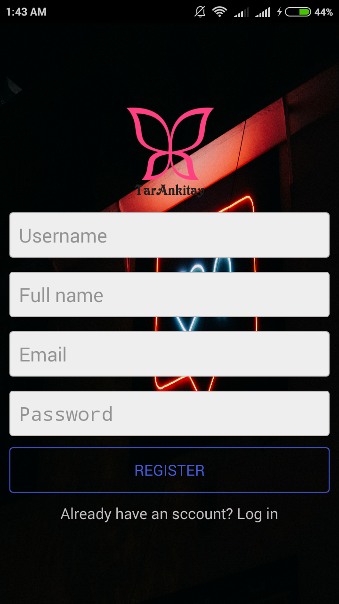
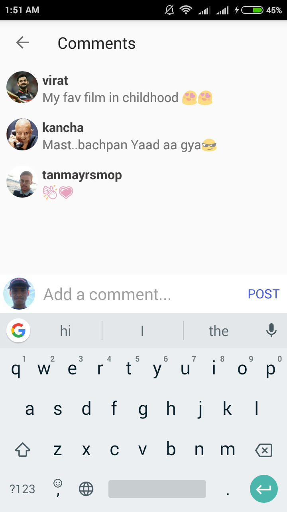
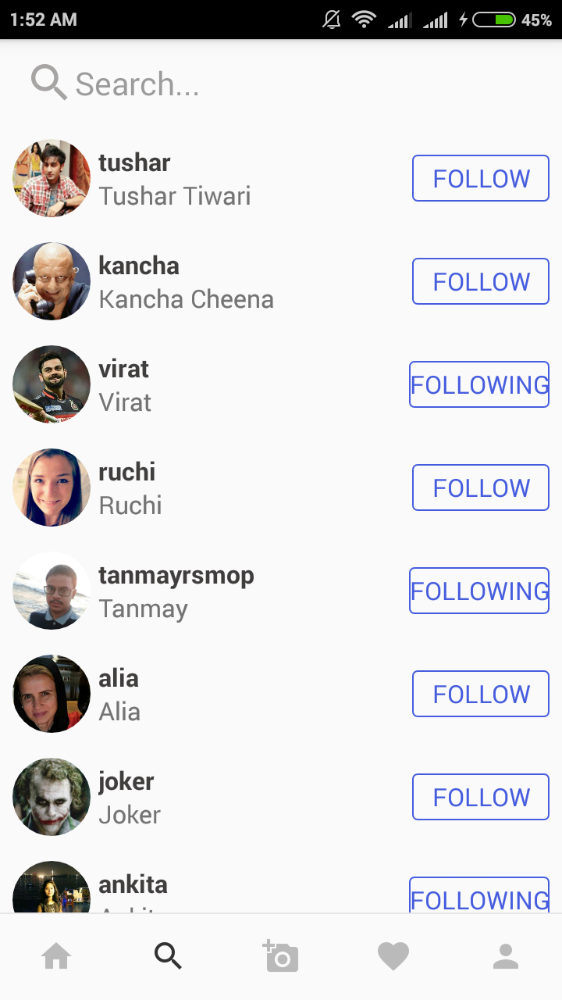
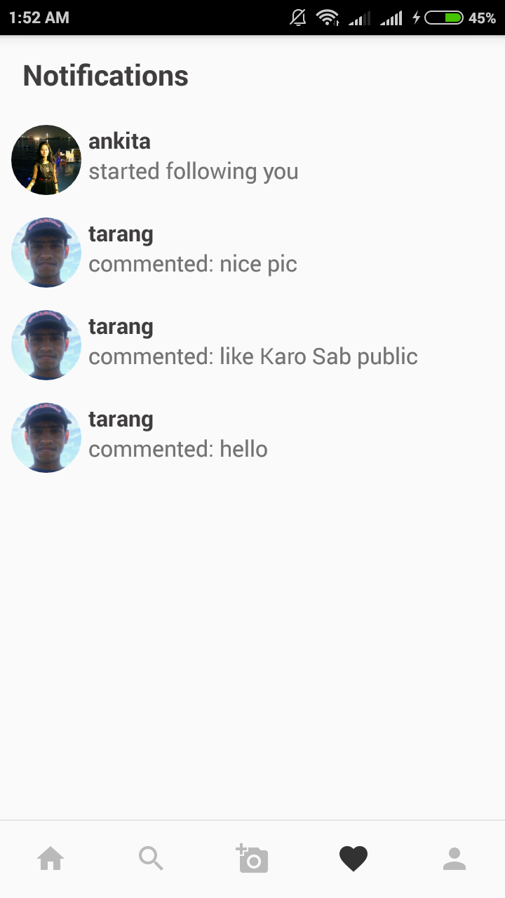
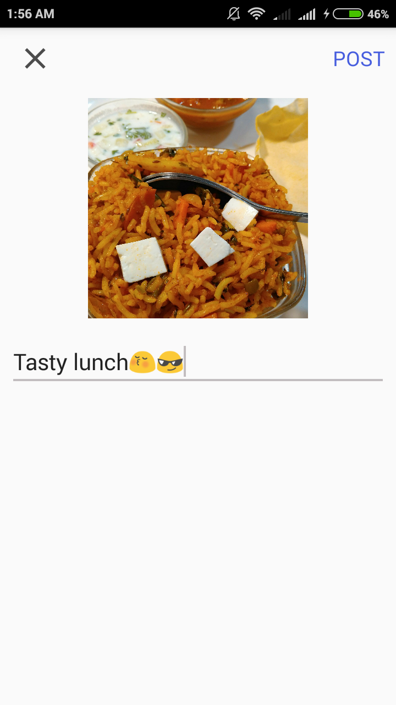
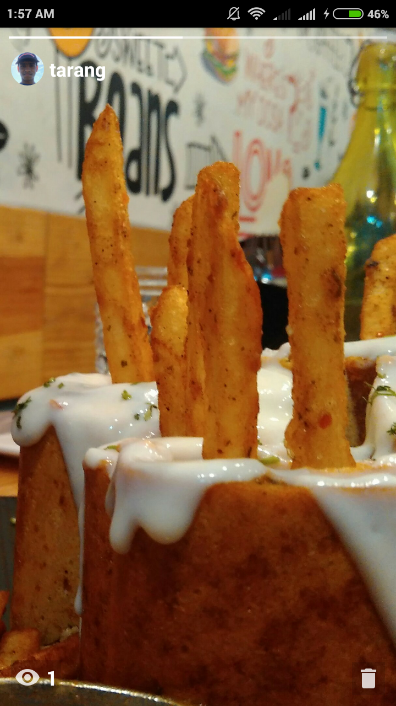
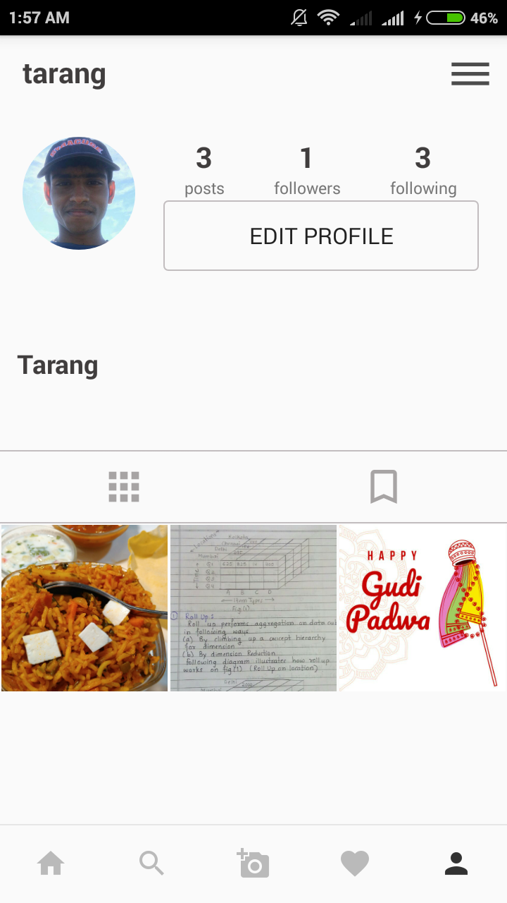

# tarankitay
A social media web app just like instagram

**Features:**
> 1. Add friend
> 2. Unfollow friend
> 3. Add story
> 4. Like ,comments ,save post
> 5. Add post
> 6. View notifications

#Screenshots:

  Login

  

  Register

  

  Splash screen

  

  Main page

  

 
  Post Comment

  

  Search friend

  

  Notifications

  

  Add post

  

  Add story

  

  My profile

  

